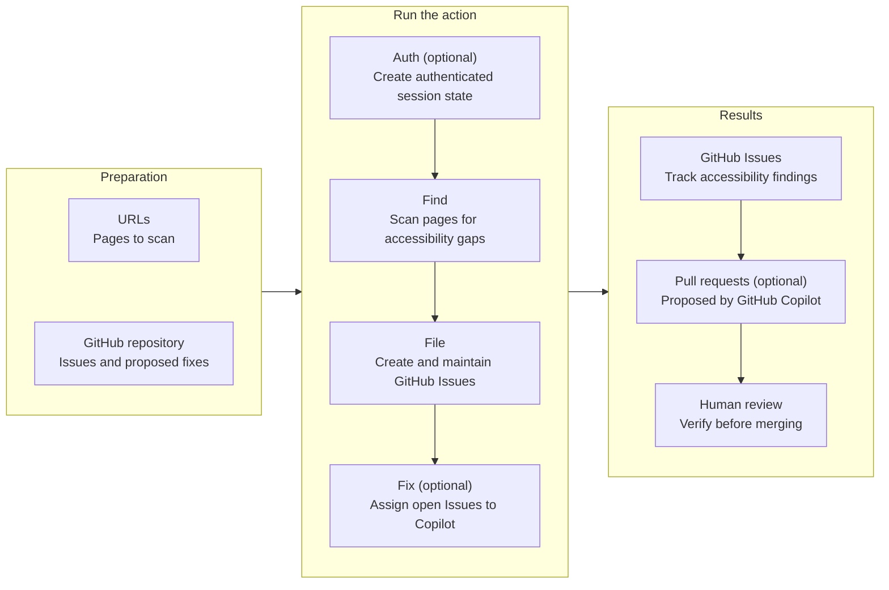
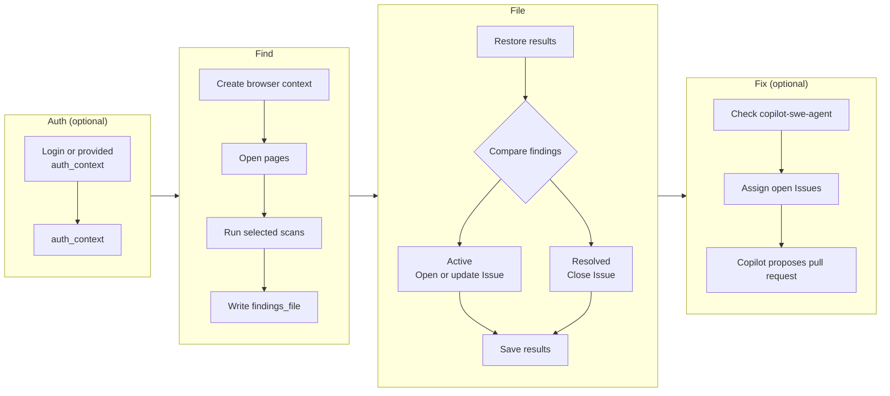

# AI-powered Accessibility Scanner

The AI-powered Accessibility Scanner (a11y scanner) is a GitHub Action that detects accessibility barriers across your digital products, creates trackable issues, and leverages GitHub Copilot for AI-powered fixes.

The a11y scanner helps teams:

- 🔍 Scan websites, repositories, and dynamic content for accessibility issues
- 📝 Create actionable GitHub issues that can be assigned to GitHub Copilot
- 🤖 Propose fixes with GitHub Copilot, with humans reviewing before merging

## Usage



### Preparation

#### URLs

URLs for the pages to scan are required. They must be reachable from the runner and configured through `urls` as follows:

```yaml
steps:
  - uses: github/accessibility-scanner@v3
    with:
      urls: | # Provide a newline-delimited list of URLs to scan; more information below.
        REPLACE_THIS
      # ...
```

#### GitHub repository

- [GitHub Actions](https://docs.github.com/en/repositories/managing-your-repositorys-settings-and-features/enabling-features-for-your-repository/managing-github-actions-settings-for-a-repository) and [GitHub Issues](https://docs.github.com/en/repositories/managing-your-repositorys-settings-and-features/enabling-features-for-your-repository/disabling-issues) enabled.
- A [fine-grained PAT](https://docs.github.com/en/authentication/keeping-your-account-and-data-secure/managing-your-personal-access-tokens) scoped to the workflow and target repositories, with `actions: write`, `contents: write`, `issues: write`, `pull-requests: write`, and `metadata: read`.
- The PAT available as an [Actions repository secret](https://docs.github.com/en/actions/how-tos/write-workflows/choose-what-workflows-do/use-secrets), such as `GH_TOKEN`.

```yaml
steps:
  - uses: github/accessibility-scanner@v3
    with:
      # ...
      repository: REPLACE_THIS/REPLACE_THIS # Provide a repository name-with-owner (in the format "primer/primer-docs"). This is where issues will be filed and where Copilot will open PRs; more information below.
      token: ${{ secrets.GH_TOKEN }} # This token must have write access to the repo above (contents, issues, and PRs); more information below. Note: GitHub Actions' GITHUB_TOKEN cannot be used here.
      cache_key: REPLACE_THIS # Provide a filename that will be used when caching results. We recommend including the name or domain of the site being scanned.
      # ...
```

#### Authentication

1. Public pages require no authentication inputs.
2. Login with a username and password requires `login_url`, `username`, and `password`.

```yaml
steps:
  - uses: github/accessibility-scanner@v3
    with:
      # ...
      login_url: # Optional: URL of the login page if authentication is required
      username: # Optional: Username for authentication
      password: ${{ secrets.PASSWORD }} # Optional: Password for authentication (use secrets!)
      # ...
```

3. Alternatively, other authentication flows require `auth_context`, a stringified `AuthContextInput` object; when provided, the username/password login inputs are ignored.

```yaml
steps:
  - uses: github/accessibility-scanner@v3
    with:
      # ...
      auth_context: # Optional: Stringified JSON object for complex authentication
      # ...
```

```ts
export type AuthContextInput = {
  username?: string
  password?: string
  cookies?: Cookie[]
  localStorage?: LocalStorage
}
```

#### Issue and fix behavior

- `skip_copilot_assignment: false` enables Copilot assignment when available. `true` still maintains Issues but skips Copilot assignment.
- `dry_run: false` uses the normal Issue and cache lifecycle. `true` only reports proposed Issue changes, without modifying Issues, assigning Copilot, or writing cached results.

```yaml
steps:
  - uses: github/accessibility-scanner@v3
    with:
      # ...
      skip_copilot_assignment: false # Optional: Set to true to skip assigning issues to GitHub Copilot (or if you don't have GitHub Copilot)
      dry_run: false # Optional: Set to true to scan and log what would be filed without creating/closing issues or writing the cache
      # ...
```

#### Scans

`scans` selects the scan engines and plugins. If omitted, only Axe runs; `axe` and `accesslint` are built-in engines, while other entries identify scanner plugins.

| Option | Type | When to use it |
| --- | --- | --- |
| [`axe`](https://github.com/dequelabs/axe-core) | Built-in, default | The mature, well-documented baseline. Omit `scans` or use `["axe"]` to run only Axe. |
| [`accesslint`](https://github.com/AccessLint/accesslint) | Built-in | A lightweight second ruleset that adds some checks Axe does not run by default. It can run alone or with Axe; running both may produce overlapping findings. See [Axe vs. AccessLint](https://github.com/github/accessibility-scanner/blob/main/AXE_VS_ACCESSLINT.md) for a rule-level comparison. |
| [`reflow-scan`](https://github.com/github/accessibility-scanner/blob/main/.github/scanner-plugins/reflow-scan/index.ts) | Example local plugin | Checks for horizontal scrolling at a 320 px viewport as a signal for [WCAG 2.2 Reflow](https://www.w3.org/WAI/WCAG22/Understanding/reflow.html). It demonstrates a repository-specific plugin and is not a built-in engine. |
| Custom plugin name | Local or approved NPM plugin | Run a project-specific scan by its exported `name`. See [Plugins](https://github.com/github/accessibility-scanner/blob/main/PLUGINS.md) for the required directory, API, checkout step, configuration, and NPM plugin format. |

Use only `axe` for the lowest-noise default, add `accesslint` for broader automated coverage, and add plugin names only when those plugins are available to the workflow.

```yaml
steps:
  - uses: github/accessibility-scanner@v3
    with:
      # ...
      scans: '["axe","accesslint","reflow-scan"]' # Optional: An array of scans (or plugins) to be performed. Built-in engines are 'axe' and 'accesslint'; any other entry is a plugin name. If not provided, only Axe will be performed.
      # ...
```

### Job configuration

A workflow under `.github/workflows/`, with [this repository's workflow](.github/workflows/accessibility-scanner.yml) as a reference for a site served from the runner:

```yaml
name: Accessibility Scanner
on: workflow_dispatch # This configures the workflow to run manually, instead of (e.g.) automatically in every PR. Check out https://docs.github.com/en/actions/reference/workflows-and-actions/workflow-syntax#on for more options.

jobs:
  accessibility_scanner:
    runs-on: ubuntu-latest
    steps:
      - uses: github/accessibility-scanner@v3
        with:
          urls: | # Provide a newline-delimited list of URLs to scan; more information below.
            REPLACE_THIS
          repository: REPLACE_THIS/REPLACE_THIS # Provide a repository name-with-owner (in the format "primer/primer-docs"). This is where issues will be filed and where Copilot will open PRs; more information below.
          token: ${{ secrets.GH_TOKEN }} # This token must have write access to the repo above (contents, issues, and PRs); more information below. Note: GitHub Actions' GITHUB_TOKEN cannot be used here.
          cache_key: REPLACE_THIS # Provide a filename that will be used when caching results. We recommend including the name or domain of the site being scanned.
          # base_url: https://REPLACE_THIS # Optional: GitHub API base URL to pass into Octokit (required for GitHub Enterprise Server)
          # login_url: # Optional: URL of the login page if authentication is required
          # username: # Optional: Username for authentication
          # password: ${{ secrets.PASSWORD }} # Optional: Password for authentication (use secrets!)
          # auth_context: # Optional: Stringified JSON object for complex authentication
          # skip_copilot_assignment: false # Optional: Set to true to skip assigning issues to GitHub Copilot (or if you don't have GitHub Copilot)
          # include_screenshots: false # Optional: Set to true to capture screenshots and include links to them in filed issues
          # open_grouped_issues: false # Optional: Set to true to open an issue grouping individual issues per violation
          # group_by: finding # Optional: 'finding' (default, one issue per violation), 'rule' (one per rule), or 'rule+url' (one per rule per URL)
          # file_best_practice_issues: true # Optional: Set to false to stop filing new issues for best-practice findings (recommendations that are not hard WCAG failures)
          # file_experimental_issues: true # Optional: Set to false to stop filing new issues for experimental findings (checks that are not yet stable)
          # dry_run: false # Optional: Set to true to scan and log what would be filed without creating/closing issues or writing the cache
          # reduced_motion: no-preference # Optional: Playwright reduced motion configuration option
          # color_scheme: light # Optional: Playwright color scheme configuration option
          # scans: '["axe","accesslint","reflow-scan"]' # Optional: An array of scans (or plugins) to be performed. Built-in engines are 'axe' and 'accesslint'; any other entry is a plugin name. If not provided, only Axe will be performed.
          # url_configs: '[{"url":"https://example.com","excludeSelectors":["iframe","#widget"]}]' # Optional: Per-URL config with CSS selectors to exclude from the Axe scan. When provided, takes precedence over 'urls'.
```

#### Action inputs

| Input                       | Required | Description                                                                                                                                                                                                                                                      | Example                                                                     |
| --------------------------- | -------- | ---------------------------------------------------------------------------------------------------------------------------------------------------------------------------------------------------------------------------------------------------------------- | --------------------------------------------------------------------------- |
| `urls`                      | No\*     | Newline-delimited list of URLs to scan. Required unless `url_configs` is provided.                                                                                                                                                                               | `https://primer.style`<br>`https://primer.style/octicons`                   |
| `repository`                | Yes      | Repository (with owner) for issues and PRs                                                                                                                                                                                                                       | `primer/primer-docs`                                                        |
| `token`                     | Yes      | PAT with write permissions (see above)                                                                                                                                                                                                                           | `${{ secrets.GH_TOKEN }}`                                                   |
| `cache_key`                 | Yes      | Key for caching results across runs<br>Allowed: `A-Za-z0-9._/-`                                                                                                                                                                                                  | `cached_results-primer.style-main.json`                                     |
| `base_url`                  | No       | GitHub API base URL used by Octokit. Set this for GitHub Enterprise Server (format: `https://HOSTNAME/api/v3`). Defaults to `https://api.github.com`                                                                                                             | `https://ghe.example.com/api/v3`                                            |
| `login_url`                 | No       | If scanned pages require authentication, the URL of the login page                                                                                                                                                                                               | `https://github.com/login`                                                  |
| `username`                  | No       | If scanned pages require authentication, the username to use for login                                                                                                                                                                                           | `some-user`                                                                 |
| `password`                  | No       | If scanned pages require authentication, the password to use for login                                                                                                                                                                                           | `${{ secrets.PASSWORD }}`                                                   |
| `auth_context`              | No       | If scanned pages require authentication, a stringified JSON object containing username, password, cookies, and/or localStorage from an authenticated session                                                                                                     | `{"username":"some-user","password":"***","cookies":[...]}`                 |
| `skip_copilot_assignment`   | No       | Whether to skip assigning filed issues to GitHub Copilot. Set to `true` if you don't have GitHub Copilot or prefer to handle issues manually                                                                                                                     | `true`                                                                      |
| `include_screenshots`       | No       | Whether to capture screenshots of scanned pages and include links to them in filed issues. Screenshots are stored on the `gh-cache` branch of the repository running the workflow. Default: `false`                                                              | `true`                                                                      |
| `open_grouped_issues`       | No       | Whether to create a tracking issue which groups filed issues together by violation type. Default: `false`                                                                                                                                                        | `true`                                                                      |
| `group_by`                  | No       | How to consolidate findings when filing issues: `finding` (one issue per individual violation), `rule` (one issue per rule, aggregating every occurrence across all scanned URLs), or `rule+url` (one issue per rule per scanned URL). Default: `finding`        | `rule`                                                                      |
| `file_best_practice_issues` | No       | Whether to file issues for best-practice findings (accessibility recommendations that are not hard WCAG failures). Set to `false` to suppress new best-practice issues; existing ones are left untouched. Default: `true`                                        | `false`                                                                     |
| `file_experimental_issues`  | No       | Whether to file issues for experimental findings (checks that are not yet stable). Set to `false` to suppress new experimental issues; existing ones are left untouched. Default: `true`                                                                         | `false`                                                                     |
| `reduced_motion`            | No       | Playwright `reducedMotion` setting for scan contexts. Allowed values: `reduce`, `no-preference`                                                                                                                                                                  | `reduce`                                                                    |
| `color_scheme`              | No       | Playwright `colorScheme` setting for scan contexts. Allowed values: `light`, `dark`, `no-preference`                                                                                                                                                             | `dark`                                                                      |
| `scans`                     | No       | An array of scans (or plugins) to be performed. Built-in engines are `axe` and `accesslint`; any other entry is treated as a plugin name. If not provided, only Axe will be performed.                                                                           | `'["axe", "accesslint", ...other plugins]'`                                 |
| `dry_run`                   | No       | When `true`, scan and log the issues that _would_ be filed without opening, closing, reopening, or assigning any issues — and without writing to the `gh-cache` branch. Useful for safely previewing results. Default: `false`                                   | `true`                                                                      |
| `url_configs`               | No       | A stringified JSON array of URL config objects. Each object must have a `url` field and may have an optional `excludeSelectors` field (array of CSS selectors to exclude from the Axe scan for that URL). When provided, takes precedence over the `urls` input. | `'[{"url":"https://example.com","excludeSelectors":["iframe","#widget"]}]'` |

### Run the action

Commit the workflow under `.github/workflows/`, then run its configured trigger. The [workflow logs](https://docs.github.com/en/actions/how-tos/monitor-workflows/view-workflow-run-history) show these main steps:

- **Restore cached results**: loads results from earlier runs for comparison.
- **Authenticate** (optional): creates browser authentication state when login inputs are configured.
- **Find**: opens the URLs and runs the selected scan engines and plugins.
- **File**: creates, updates, reopens, or closes Issues. With `dry_run: true`, it only logs the proposed changes.
- **Fix** (optional): assigns open Issues to Copilot. It is skipped when `skip_copilot_assignment: true` or `dry_run: true`.
- **Save results**: writes the action output and persists screenshots and cached results. `dry_run: true` skips the screenshot and cache writes.

### Results

- Review the accessibility Issues and any linked pull requests proposed by Copilot.
- If a proposed fix needs adjustment, comment on its pull request with `@copilot` and specific instructions; Copilot can update the pull request. See [Reviewing a pull request created by Copilot](https://docs.github.com/en/copilot/using-github-copilot/coding-agent/reviewing-a-pull-request-created-by-copilot) and this [video walkthrough](https://www.youtube.com/watch?v=CvRJcEzCSQM).
- Verify the final fix and merge it after human review.

## Implementation



### Auth

- **Public pages:** no Auth action runs; Find creates a Playwright context without authentication state.
- **Username/password login:** the Auth action sets Playwright `httpCredentials` to `{username, password}`, then its [form detection and submission logic](https://github.com/github/accessibility-scanner/blob/main/.github/actions/auth/src/index.ts#L41-L58) finds fields by labels matching `/user ?name/i` and `/password/i`. It exports `username`, `password`, `cookies`, and `localStorage` as `auth_context`.
- **Provided `auth_context`:** the composite [action workflow](https://github.com/github/accessibility-scanner/blob/main/action.yml) skips username/password login and passes the supplied value directly to Find.

### Find

Find opens each URL from `urls` or `url_configs` in a Playwright context. The context applies `reduced_motion`, `color_scheme`, and the [`username`, `password`, `cookies`, and `localStorage`](https://github.com/github/accessibility-scanner/blob/main/.github/actions/find/src/AuthContext.ts) from `auth_context`. Findings are written to `findings_file`; with `include_screenshots: true`, each finding includes a screenshot reference.

- **Plugins:** each selected plugin receives the current Playwright page and an `addFinding` callback; see [Plugins](https://github.com/github/accessibility-scanner/blob/main/PLUGINS.md) for loading and configuration. Its minimum shape is:

  ```ts
  export const name = 'my-scan'
  export default async function ({page, addFinding}) {
    // Inspect page, then await addFinding({...}) for each result.
  }
  ```

- **Axe:** [`@axe-core/playwright`](https://github.com/github/accessibility-scanner/blob/main/.github/actions/find/src/findForUrl.ts) analyzes the page, applies `url_configs[].excludeSelectors`, and converts each Axe violation into findings.
- **AccessLint:** [`@accesslint/playwright`](https://github.com/github/accessibility-scanner/blob/main/.github/actions/find/src/findForUrl.ts) audits the page and converts each AccessLint violation into a finding.

### File

File uses `repository`, `token`, and `base_url` for GitHub Issues, then compares current findings with the results restored by `cache_key`; `group_by` determines how findings map to Issues. `file_best_practice_issues` and `file_experimental_issues` filter new Issues by finding category, while `open_grouped_issues: true` adds tracking Issues for groups of new Issues. `dry_run: true` reports the planned changes without changing GitHub or persisting screenshots and cached results; otherwise, updated associations and requested screenshots are saved to `gh-cache`.

- **New finding:** the [File action](https://github.com/github/accessibility-scanner/blob/main/.github/actions/file/src/index.ts) opens an Issue.
- **Repeated finding:** it reopens and updates the existing Issue. A closed Issue labeled `wontfix` remains closed; see the [reopen decision](https://github.com/github/accessibility-scanner/blob/main/.github/actions/file/src/shouldReopenIssue.ts).
- **Resolved finding:** it closes the existing Issue.

### Fix

`skip_copilot_assignment: true` skips Fix without affecting Issue maintenance or normal cache persistence.

- **Check availability:** the [Fix action](https://github.com/github/accessibility-scanner/blob/main/.github/actions/fix/src/assignIssue.ts) queries the GitHub GraphQL API for the `copilot-swe-agent` suggested actor.
- **Assign:** when available, `copilot-swe-agent` is assigned to each open Issue received from File.
- **Pull request:** after assignment, Copilot coding agent works on the Issue and proposes a pull request. This happens outside the action.

